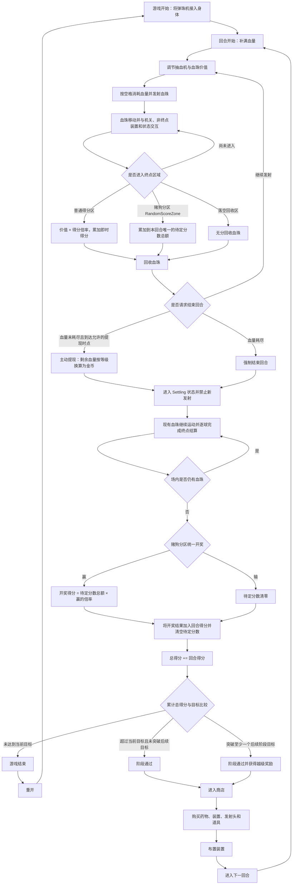

# 弹珠机玩法流程设计

> 首版代码已经按下方第 12 节的最新确认落实；仍标注待定的边界、数值和架构取舍见 [Implementation.md](Implementation.md)，策划配置见 [Balance.md](Balance.md)。

> 文档状态：玩法概念整理稿  
> 目的：统一核心循环、资源、结算规则与内容分类。原始记录中尚未明确的规则集中列在“待确认项”中。

## 1. 游戏概述

玩家将弹珠机接入身体，以自身血量制造并发射“血珠”。血珠在弹珠机内受到机关、装置、药物和随机事件影响，最终转化为即时得分、赌狗分区中的待定分数或金币。

玩法的核心选择是：

- 继续消耗血量发射血珠，冲击更高分数与越级奖励。
- 在血量耗尽前主动提现，将剩余血量转化为金币并提前结束本回合。

核心循环为：

```text
抽血发射 → 物理碰撞与装置交互 → 即时得分/待定分数累加 → 统一结算
→ 目标判定 → 商店购买与装置布置 → 下一回合
```

## 2. 统一术语与核心资源

全文统一使用“血珠”指玩家发射的弹珠；“特殊血珠”指受到药物、病理、装置或随机事件影响的血珠。

| 名称 | 说明 |
|---|---|
| 血量 | 玩家每回合的生命与发射资源；发射血珠时消耗，回合开始时补满。 |
| 血珠价值 | 单颗血珠当前携带的基础价值，可被抽血机、装置和状态提高或降低。 |
| 得分倍率 | 血珠自身倍率、临时倍率与终点区域倍率等乘区的统称。 |
| 即时得分 | 血珠进入普通得分装置或分区后立即获得、在本回合内持续累加的分数。 |
| 回合得分 | 本回合即时得分与赌狗分区开奖得分的合计。 |
| 总得分 | 每次结算后累加回合得分，用于阶段目标判定的累计分数。 |
| 金币 | 在商店购买药物、装置、发射头和道具的货币。 |
| 目标得分 | 当前阶段的通关门槛。超过后续阶段门槛时，可触发越级奖励。 |
| 运气 | 可能影响赌狗分区、Rush 或其他概率事件的属性，具体作用范围待定。 |
| Rush | 概率触发的短时爆发状态，可通过强化提升持续时间、倍率和触发概率。 |

原概念稿中的“赌狗装置”对应 [PachinkoECSDesign_3D.xlsx](../PachinkoECSDesign_3D.xlsx) 里的 `RandomScoreZone`。本文将其统一称为 **赌狗分区（`RandomScoreZone`）**：它属于特殊得分分区，不属于可布置装置。血珠进入后累加待定分数，并在结算阶段统一开奖；“待定分数”仍然只是分数，不新增资源类型。

## 3. 游戏总流程



普通得分区与赌狗分区都是终点：普通得分区立即累加得分；赌狗分区只累加待定分数，等场内血珠排空后统一开奖。两类分区处理后都会回收血珠。原始记录没有说明“恰好等于目标分”时的结果，因此流程图没有替该边界做决定。

## 4. 单回合详细流程

### 4.1 回合开始

1. 补满本回合血量。
2. 读取当前阶段目标得分。
3. 加载本回合可用的商店购买项和装置布局；具体继承、消耗与清空规则待定。
4. 玩家调节抽血机与血珠价值；二者之间的数值关系待定。

### 4.2 发射与场内交互

1. 玩家按下空格。
2. 抽血机扣除对应血量。
3. 血珠从血珠喷口发射。
4. 血珠在场内移动，并可能受到以下内容影响；不同效果的处理与结算顺序待定：
   - 场景机关改变移动路径。
   - 物理装置改变速度、方向、弹性、重力、黏性或数量。
   - 价值装置提高或降低当前价值。
   - 运气装置改变概率类结果。
   - 药物和病理状态赋予特殊效果。
5. 普通装置属于途经交互，处理效果后血珠继续运动。
6. 血珠进入普通得分区、赌狗分区或落空回收区后完成一次终点处理，并被回收。

如果同一物理步内命中多个终点候选，按 `Priority` 降序选择；同优先级再按区域 `StableId` 升序选择。每颗血珠最多结算一个终点。

### 4.3 血珠的分区与出口结果

| 接触对象 | 处理结果 |
|---|---|
| 普通得分区 | 按“血珠当前价值 × 得分倍率”计算即时得分，累加到回合得分，然后回收血珠。 |
| 赌狗分区 `RandomScoreZone` | 将血珠当前分数累加到本回合唯一的待定分数总额，不立即加入回合得分，然后回收血珠。 |
| 落空回收区 `DrainZone` | 无分回收血珠。 |

原笔记中的“专门金币装置”仍可作为后续玩法内容，但它不等同于赌狗分区；其是否为终点、如何换算金币需要另行定义。

### 4.4 回合结束条件

回合可通过两种方式结束：

1. **血量耗尽：**停止继续发射，强制进入结算。
2. **主动提现：**血量未耗尽且到达允许的提现时点时，玩家主动结束回合；剩余血量按等级对应的换算规则变为金币，然后进入结算。允许提现的具体时点待定。

触发回合结束后进入 `Settling`：禁止继续发射，现有血珠继续运动，直到全部完成终点处理或回收；随后赌狗分区统一开奖，再进行总得分与阶段目标结算。

## 5. 得分与赌狗分区结算

### 5.1 普通得分

血珠进入普通得分区时立即计分：

```text
单次即时得分 = 血珠当前价值 × 得分倍率
```

所有单次即时得分持续累加到本回合得分中。数值取整、倍率叠加顺序与上下限待定。

### 5.2 赌狗分区

赌狗分区是 `RandomScoreZone` 对应的特殊得分分区，不是装置。血珠进入后：

1. 读取血珠当前分数，并累加到本回合唯一的待定分数总额；所有 `RandomScoreZone` 共用该总额。
2. 血珠被回收，本次不立即增加回合得分。
3. 回合进入结算且场内血珠排空后，赌狗分区统一开奖一次。

开奖结果：

- **赢：**`开奖得分 = 待定分数总额 × 赢的倍率`，将开奖得分加入回合得分。
- **输：**待定分数清零，本次不增加得分。
- **开奖完成：**清空待定分数，避免带入下一回合。

“待定分数”只是普通分数在开奖前的未确定状态，不新增货币或资源系统。

### 5.3 回合得分与总得分

```text
回合得分 = 所有即时得分之和 + 赌狗分区开奖得分
结算后总得分 = 结算前总得分 + 回合得分
```

完成上述累加后，再使用总得分进行阶段目标和越级判定。Rush 是否作用于即时得分、待定分数、赢的倍率或最终开奖得分，尚待确认。

## 6. 阶段目标、越级与失败

结算完成后，将总得分与目标得分比较。以下表格沿用原始记录中的“超过”和“突破”措辞，不预先决定等于边界：

| 结算结果 | 后续流程 |
|---|---|
| 未达到当前阶段目标 | 挑战失败，游戏结束，可选择重开。 |
| 恰好等于任一目标 | 通过边界待确认。 |
| 超过当前阶段目标，但未突破后续目标 | 当前阶段通过，进入奖励与商店流程。 |
| 突破一个或多个后续阶段目标 | 当前阶段通过，并获得对应越级奖励。 |

越级判定建议以“本次得分跨过的最高阶段目标”为准，但以下规则仍需确定：

- 越级是直接跳过对应阶段，还是只发放额外奖励。
- 一次最多可越过多少阶段。
- 越级奖励的类型与数量。
- 达到目标值时算通过，还是必须严格超过目标值。

## 7. 金币、商店与局间成长

### 7.1 金币来源

1. 主动提现时，将剩余血量转为金币。
2. 血珠进入专门的金币装置。
3. “卖器官”机制：保留为主题概念，名称与表现需要进行合规、和谐化处理。

剩余血量转金币的暂定公式结构为：

```text
提现金币 = 剩余血量 × 等级对应换算系数 × 其他金币加成
```

原始记录中的具体公式尚未完成。“等级”具体指玩家等级、回合等级、阶段等级还是其他等级，以及转换系数与取整方式，均待定。

### 7.2 商店消费

玩家通过阶段后进入商店，使用金币购买：

- **药物：**在一定时间内赋予血珠特殊效果。
- **装置：**提供得分、物理、价值、运气或生物互动效果。
- **发射头：**改变血珠的发射方式，具体属性待定。
- **道具：**具体功能与消耗方式待定。

购买完成后，玩家布置或调整装置，然后进入下一回合。

## 8. Rush 系统

Rush 为概率触发的短时强化状态。当前明确的强化方向有：

- 提高 Rush 持续时间。
- 提高 Rush 收益倍率。
- 提高 Rush 触发概率。

以下内容尚待确定：触发检测时点、基础概率、状态期间的具体收益、能否刷新或叠加，以及运气属性如何参与计算。

## 9. 药物、病理与特殊血珠

### 9.1 药物

玩家可以嗑药。在药效持续时间内发射的血珠获得特殊效果。

- “摇头丸”暂列为药物示例，具体效果待设计。
- 特殊药品可以影响生物类对象或装置；原始记录中的“生物破坏装置”具体指什么、产生什么结果，尚待设计。
- 药效持续方式、叠加规则，以及是否影响已经在场内的血珠，均待确认。

### 9.2 血常规与病理状态

可使用以下身体指标或病理状态生成特殊规则：

- 血脂
- 血压
- 血糖
- 凝血功能异常

这些状态可从以下维度影响血珠：

- 价值增加或减少。
- 物理属性变化。
- 出现概率性碎裂。

各病理状态与具体效果之间的对应关系需要单独设计，避免在概念阶段提前绑定。

### 9.3 特殊血珠

特殊血珠可由药物、病理、装置或随机事件产生。可用的效果方向包括：

- 分裂为多颗血珠。
- 具有更高或更低价值。
- 具有特殊重量、弹性、黏性或受力方式。
- 碰撞或移动过程中有概率碎裂。
- 携带影响生物装置或其他机关的效果。

## 10. 场景机关、装置与分区分类

### 10.1 场景机关

场景机关主要改变血珠的移动路径和物理状态。

| 机关 | 预期作用 |
|---|---|
| 墙体 | 阻挡并改变移动路径。 |
| 弹弹板 | 碰撞后将血珠弹向其他区域。 |
| 带刺装置 | 原始候选效果为分裂血珠；是否也会使其碎裂待定。 |
| 吹风装置 | 对一定范围内的血珠持续施力。 |
| 重力力场 | 改变局部重力方向或强度。 |
| 水桶 | 已列入机关候选，具体行为待定。 |
| 旋转木桶大炮 | 已列入机关候选，具体行为待定。 |
| 绳子与切绳机关 | 绳子黏住血珠；切断后释放并改变路径。 |
| 粘粘板 | 黏住或显著减速血珠。 |

### 10.2 功能装置

| 装置类型 | 核心作用 |
|---|---|
| 得分装置 | 将血珠当前价值按倍率转为即时得分。 |
| 金币装置 | 将血珠或其价值转为金币。 |
| 物理装置 | 改变速度、方向、弹性、重力、黏性或血珠数量。 |
| 价值装置 | 增加或减少血珠当前价值。 |
| 运气装置 | 影响赌狗分区、Rush 或随机事件的概率结果。 |
| 生物装置 | 特殊药品可对其产生影响；具体对象和结果待定。 |

### 10.3 特殊分区

| 分区 | 核心作用 |
|---|---|
| 赌狗分区 `RandomScoreZone` | 所有该类分区共用本回合唯一的待定分数总额，并在结算阶段统一开奖一次。它是特殊得分分区，不是装置。 |
| 落空回收区 `DrainZone` | 回收落空血珠，不产生得分。 |

## 11. 随机事件与临时增益

随机事件可以改变当前回合的场景、血珠或收益规则。现有候选包括：

- 收益翻倍。
- 提高 Rush 触发概率。
- 临时生成或改变墙体、弹弹板、风场、重力场等机关。
- 赋予血珠分裂、黏附、碎裂等特殊状态。

随机事件的触发时点、持续时间、正负面比例与是否可被运气影响，均待确定。

## 12. 剩余待确认项

赌狗分区的类型、待定分数规则和统一开奖时点已经确认，并已写入正式流程；下方只保留尚未确定的规则。

### 发射与血量

- 每颗血珠固定扣血，还是由抽血机档位决定扣血量？ 抽血机档位
- 调高血珠价值是否必然增加耗血量？ 不一定
- 血量为零时，是否等待所有场内血珠完成运动后再结算？ 是的

### 提现与结算

- 玩家可以在任意时刻提现，还是只能在特定节点提现？ 在达到目标后才能主动提现
- 主动提现后若未达到目标，是立即失败，还是仍可保留部分收益？
- 得分、金币和装置哪些跨回合保留，哪些在重开时清零？目前都跨回合保留
- 本稿暂按跨回合累计总得分判定目标，最终是否采用该口径？总得分何时重置？
- 各项数值的取整规则与上限是什么？

### 赌狗分区的数值与运气

- 胜负概率和获胜倍率如何生成？
- 运气影响胜率、倍率，还是二者都影响？

### Rush

- 哪些行为可以触发 Rush？弹珠落入得分区域有概率触发一定时间的rush
- Rush 倍率具体作用于得分、价值、金币还是全部收益？会让进入得分区域的弹珠得分x2
- Rush 能否叠加、刷新持续时间，是否存在上限？能

### 商店与布置

- 商店商品固定展示还是随机刷新？花金币刷新
- 装置能否升级、出售或合成？只能出售
- 可布置区域、数量、移动与旋转规则是什么？玩家可以在回合开始前随便将已有的装置放到盘面上
- 发射头具体影响初速度、方向、散射、连发还是其他属性？暂时没有其他属性

### 药物、病理与表现

- 药效按现实时间、发射次数还是回合数持续？一定时间持续
- 药物能否叠加，药物之间是否存在组合或冲突？可以
- “概率碎掉”具体指血珠碎裂、装置损坏还是收益丢失？是指会让弹珠有一些增益，但同时会带来一些负面效果，比如有概率在撞击时碎掉
- “卖器官”的替代表现与实际玩法收益是什么？暂时不要实现卖器官系统

## 13. 建议的首版可玩闭环

首版原型可先验证最核心的风险与收益循环：

1. 回合开始时补满血量。
2. 调节单颗血珠的耗血量与价值。
3. 按空格发射，并完成基础物理碰撞。
4. 提供一个普通得分装置和一个赌狗分区。
5. 支持血量耗尽强制结算与主动提现。
6. 完成目标得分、阶段通过、失败和越级判定。
7. 将剩余血量转为金币，并提供简单商店。
8. 购买、布置装置后进入下一回合。

Rush、复杂药物与病理、特殊血珠、大型随机事件和多种复杂机关，可在核心闭环验证后逐步加入。
